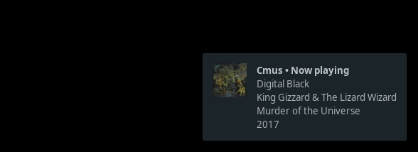

# cmushnotify

A simple shell script for showing notifications for [cmus - the C* Music Player](https://cmus.github.io/).



### Dependencies

* libnotify + a notification server
* ffmpeg (optional, for embedded album art)

### Installation

Clone the repository or just download `cmushnotify` and make it executable:

```bash
chmod a+x cmushnotify
```

Optionally, you may want to move it to one of the directories in your `PATH` environment variable.

In cmus, set `cmushnotify` as status display program typing the following command:

```
:set status_display_program=[/PATH/TO/YOUR/SCRIPT/]cmushnotify
```

If you are already using another script as your status display program in cmus, follow the instructions at [cmus wiki](https://github.com/cmus/cmus/wiki/status-display-programs#usage--installation) on how to use multiple programs. 
